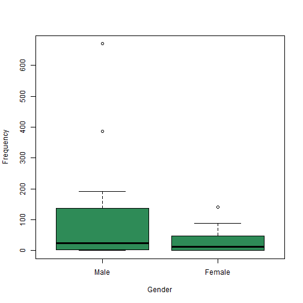
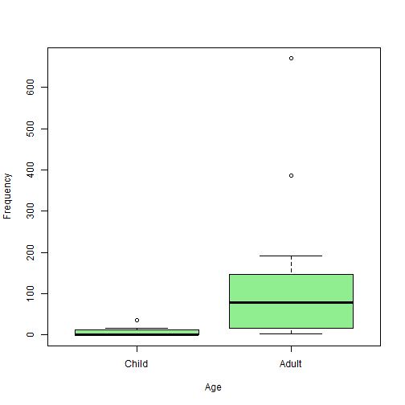
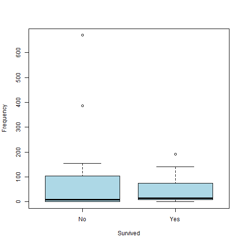
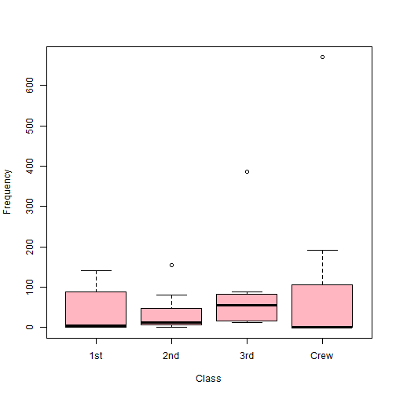

Titanic Dataset
=========================
author: Camila San José
font-import: https://fonts.googleapis.com/css?family=Comfortaa&display=swap
font-family: 'Comfortaa' 
css: custom.css


Introduction
=========================
transition: none

The dataset `Titanic` was chosen from the R-Package `Stat2DAta`. 


Dataset
=========================
type: sub-section
incremental: true
transition: rotate

This dataset provides the following variables of the passengers of the famous cruiship the Titanic: 

<li class="fragment fade-in"> Passenger class ($1_{st}, 2_{nd}$ or $3_{rd}$)</li>
<li class="fragment fade-in"> Age (Child or Adult)</li>
<li class="fragment fade-in"> Sex (Male or Female)</li>
<li class="fragment fade-in"> If they survived (yes or no)</li>


Titanic Table
========================================================

Here we can see the `Titanic` dataset


```r
head(Titanic)
```

```
  Class    Sex   Age Survived Freq
1   1st   Male Child       No    0
2   2nd   Male Child       No    0
3   3rd   Male Child       No   35
4  Crew   Male Child       No    0
5   1st Female Child       No    0
6   2nd Female Child       No    0
```


Boxplot of Men and Women
========================================================


```
  Class       Sex        Age     Survived      Freq       
 1st :8   Male  :16   Child:16   No :16   Min.   :  0.00  
 2nd :8   Female:16   Adult:16   Yes:16   1st Qu.:  0.75  
 3rd :8                                   Median : 13.50  
 Crew:8                                   Mean   : 68.78  
                                          3rd Qu.: 77.00  
                                          Max.   :670.00  
```


Boxplot of Men and Women, Child and Adult
========================================================


***


Boxplot of Survivial and Class
========================================================


***



Conclusions 
========================================================
incremental: true 

- There were many more **males** than females in the ship.
- There were much more **adults** than children in the ship.
- There are much more people that did *not* survive, than those who did. 
- There is a higher average of people in **third** class, and a lot more people in crew. 

References
========================================================

From **Google images**:
- [2,200 Passengers, a brave priest, and a ship name Titanic](https://faithmag.com/sites/default/files/styles/article_full/public/2018-09/titanic2.jpg?h=6521bd5e&itok=H8td6QVv)
